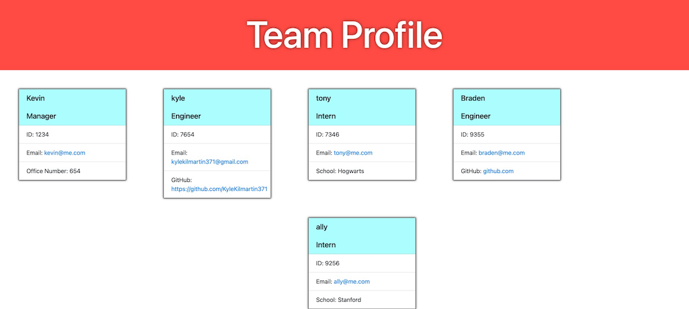

# My Team Generator

 ## Table of contents
* [Installation](#installation)
* [Usage](#usage)
* [Credits](#credits)
* [License](#license)

---
## Description

  This project is a command line application that will prompt the user for input about team members and then will return an html page with all of the team members nicely organized. 

## Installation
  In order to run this program the user must install NPM, then from npm install inquire and jest. From there run 'node index' in the command line and the program should begin!

## Usage

  ---

## Credits
  No collaborators were used to make this project

  ### GitHub Repository
https://github.com/KyleKilmartin371/my-team-generator

  ---
### License
  https://opensource.org/licenses/MIT

